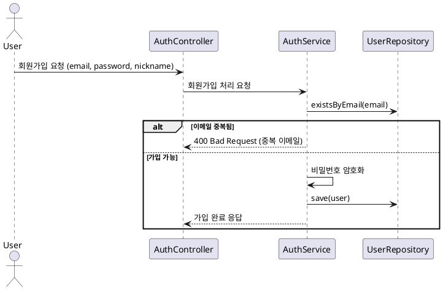

# 🙋‍♂️ 회원가입 흐름 - 플로우차트 및 시퀀스 다이어그램

이 문서는 사용자의 회원가입 처리 로직을 시각적으로 이해하기 위해 작성되었습니다.

---

## ✅ 회원가입 플로우차트

```
[회원가입 요청]
     ↓
[이메일 중복 확인]
     ↓
[비밀번호 암호화 (BCrypt 등)]
     ↓
[DB에 사용자 정보 저장]
     ↓
[회원가입 완료 응답]
```

---

## ✅ 회원가입 시퀀스 다이어그램



---

## 💡 비고

- 회원가입 시 이메일 중복 검사는 필수입니다.
- 비밀번호는 반드시 단방향 해시 알고리즘(예: BCrypt)을 사용해 암호화합니다.
- 현재 회원가입 시 비밀번호 복잡도(특수문자 포함, 길이 등) 검사는 따로 적용하지 않으며, 기본 유효성은 프론트엔드에서 처리된다는 가정 하에 서버에서는 암호화 및 저장만 수행합니다.
- 이후 로그인 시 사용자가 입력한 비밀번호를 복호화하지 않고, 같은 방식으로 암호화한 값과 비교합니다.

