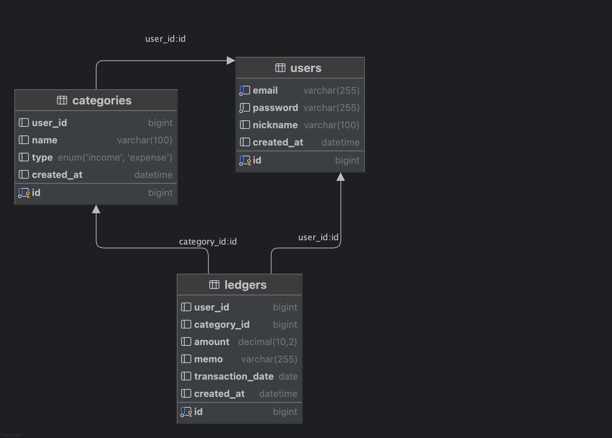

# 📊 ERD 설계 문서

## ✅ users — 사용자 테이블

| 컬럼명         | 타입       | 설명          |
| ----------- | -------- | ----------- |
| id          | BIGINT   | 사용자 ID (PK) |
| email       | VARCHAR  | 이메일 (유니크)   |
| password    | VARCHAR  | 암호화된 비밀번호   |
| nickname    | VARCHAR  | 사용자 닉네임     |
| created_at  | DATETIME | 가입 일시       |

## ✅ categories — 수입/지출 카테고리

| 컬럼명         | 타입          | 설명                   |
| ----------- | ----------- | -------------------- |
| id          | BIGINT      | 카테고리 ID (PK)         |
| user_id     | BIGINT (FK) | 사용자 ID               |
| name        | VARCHAR     | 카테고리 이름              |
| type        | ENUM        | 'INCOME' / 'EXPENSE' |
| created_at  | DATETIME    | 생성일                  |

## ✅ ledgers — 수입/지출 내역

| 컬럼명           | 타입          | 설명                |
| ---------------- | ------------- | ----------------- |
| id               | BIGINT        | 거래 내역 ID (PK)     |
| user_id          | BIGINT (FK)   | 사용자 ID           |
| category_id      | BIGINT (FK)   | 카테고리 ID          |
| amount           | DECIMAL       | 금액                |
| memo             | VARCHAR       | 메모 (선택)           |
| transaction_date | DATE          | 실제 거래일           |
| created_at       | DATETIME      | 기록 등록일           |
| is_deleted       | BOOLEAN       | 삭제 여부 (기본값 false) |

## 🔗 테이블 관계 요약 (논리적 관계)

- users (1) ↔ (N) categories
- users (1) ↔ (N) ledgers
- categories (1) ↔ (N) ledgers

## 💡 설계 방침 요약

- 실제 DB에는 외래 키(FK) 제약조건을 걸지 않음
    - 이유:
        - 실무 환경에서의 성능 최적화 및 유연한 마이그레이션을 고려함
        - FK가 존재하면 데이터 변경 시 트랜잭션 충돌(Deadlock)이나 제약 위반 발생 가능성이 높아짐
        - 대규모 트래픽 상황에서 성능 이슈가 생길 수 있음
    - 대신, **애플리케이션(JPA 레벨)** 에서 관계를 관리하고 데이터 무결성을 보장함
- JPA에서는 관계를 매핑하되, DB에서는 성능과 유연성을 위해 FK 생략
- 모든 테이블 이름은 **복수형**으로 통일
- 향후 통계 API는 `ledgers` 데이터를 기반으로 실시간 집계

---

## ✏️ 변경 이력

- `ledgers` 테이블에 `is_deleted` 컬럼 추가 (소프트 삭제 방식 적용)

---

이 문서는 `/docs/domain/ERD.md`에 위치하며, 프로젝트 내 설계 기준으로 사용됩니다.